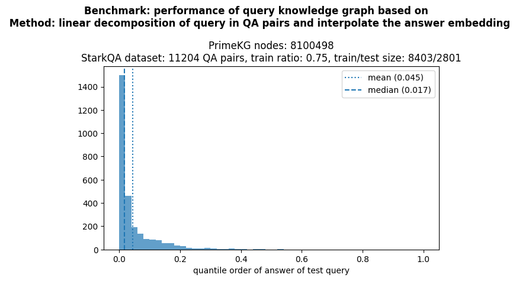

# knowledge_graph_query

Query a knowledge graph for drugs/diseases using LLM embedding

Using linear algebra and a training set of (question, answer) pairs to predict answers for new queries.

Evaluating on the test set, the score will be the quantile of order where the true answer was found (0=first match, 1=last match).
A median of 0.017 means that the true answer is within the first 1.7% of the found answers.




**references:**

databases:
- PrimeKG knowledge graph: https://github.com/mims-harvard/PrimeKG
- STaRK question/answers: https://github.com/snap-stanford/stark
  - database explanation: https://stark.stanford.edu/dataset_prime.html

modules:
- embedding using Sentence Transformer: https://www.sbert.net/docs/quickstart.html
- project using these databases:
  - https://github.com/VirtualPatientEngine/AIAgents4Pharma
  - https://virtualpatientengine.github.io/AIAgents4Pharma/notebooks/talk2knowledgegraphs/tutorial_starkqa_primekg_textual_embeddings_nomic_embed_text/


## Installation

### virtual environment
```
cd ~/python_virtual_environments/
python3 -m venv kg
source ~/python_virtual_environments/kg/bin/activate
```

```
python3 -m pip install --upgrade pip
python3 -m pip install --upgrade numpy scipy matplotlib
python3 -m pip install --upgrade pandas pyarrow
python3 -m pip install --upgrade sentence-transformers

pip install ipykernel
python -m ipykernel install --user --name=kg
jupyter kernelspec list

python3 -m pip install --upgrade jupyter ipywidgets

jupyter notebook
```


## dataset: knowledge graph

download the knowledge graph (PrimeKG) and QA data (stark_qa)

```
wget -O kg.csv https://dataverse.harvard.edu/api/access/datafile/6180620
wget -O stark_qa.csv https://stark.stanford.edu/data/primekg/stark_qa.csv
```
